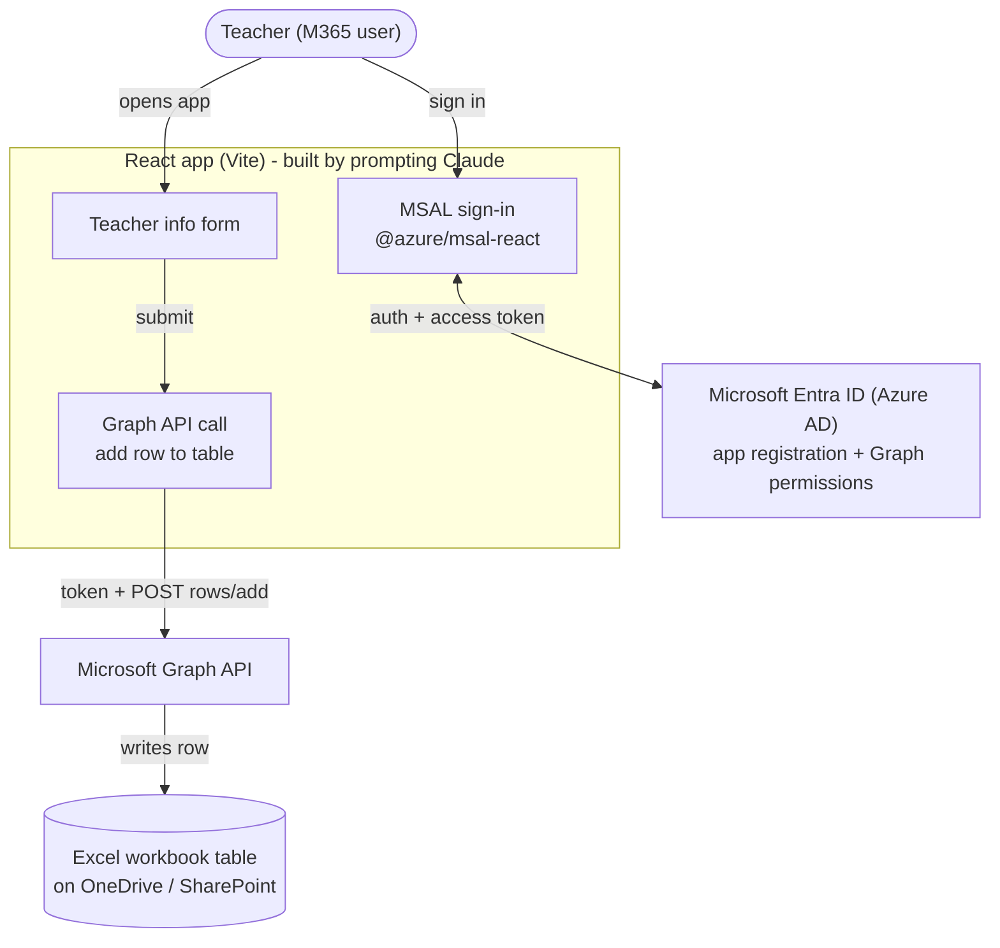

# Training Track — Build a Teacher-Info Form App with Claude (React + Microsoft Graph)

> A standalone, project-based curriculum that teaches **non-technical** people to build a
> real web app **entirely by prompting Claude** — a Google-Forms-style app that collects
> teacher information and stores each submission as a row in an **Excel workbook** on
> **OneDrive/SharePoint**, with **Microsoft sign-in**.

## The core idea

Learners never hand-write code. They learn a repeatable loop:

> **Describe → let Claude build → run it → paste back any error → repeat.**

The skill being taught is *directing Claude*, plus doing the handful of Microsoft admin-portal
steps (which are clicks, not code) with Claude guiding them step-by-step.

## What they will build

| Aspect | Choice |
|--------|--------|
| App | React (Vite) single-page app, generated by Claude |
| Sign-in | Microsoft (Entra ID / Azure AD) via **MSAL** — internal M365 users must log in |
| Data store | **Excel workbook** (a table) on OneDrive / SharePoint |
| Write mechanism | **Microsoft Graph API** — add a row to the Excel table |
| Form content | Teacher info (name, subject, email, experience, etc.) |

## Honest scope note (for the coach)

This is more advanced than a no-code form, and that's intentional. Two realities to set
expectations:

1. **Claude writes 100% of the code** — React, MSAL config, Graph API calls. Learners prompt;
   they don't type code.
2. **The Microsoft setup is manual clicks** — registering the app in Entra ID, granting Graph
   permissions, and creating the Excel table. Claude gives exact step-by-step instructions,
   but the learner performs them in the Microsoft portal. Some steps (e.g. Graph permission
   consent) may need a **tenant admin**, so a coach/admin should be available for that.

## Architecture



### ASCII fallback

```
 Teacher ─► React app (Vite)
              │  sign in (MSAL)  ◄──► Microsoft Entra ID
              │                        (app registration + Graph perms)
              │  access token
              ▼
       submit form ─► Microsoft Graph API ─► Excel table (OneDrive/SharePoint)
```

## Tech stack (all generated/configured by Claude)

- **React + Vite** — the app scaffold.
- **@azure/msal-browser** + **@azure/msal-react** — Microsoft sign-in (PKCE/SPA flow).
- **Microsoft Graph REST API** — `POST /me/drive/items/{id}/workbook/tables/{table}/rows/add`
  (OneDrive) or the `/sites/{site-id}/...` equivalent (SharePoint).
- **Delegated permissions** — `User.Read`, `Files.ReadWrite` (OneDrive) or
  `Sites.ReadWrite.All` (SharePoint; needs admin consent).

## Prerequisites (set up in Module 0)

- A work/school **Microsoft 365 account** in the org tenant.
- **Node.js** + **VS Code** installed.
- **Claude** access (Claude Code in the terminal, or claude.ai).
- A tenant admin reachable for Graph permission consent.

## Curriculum roadmap

Each module = short lesson + a hands-on prompt exercise + an end-of-module quiz. Sections are
taken in order; the quiz gates the next one (same pattern as the main training platform).

| # | Module | Learner outcome | Quiz checks |
|---|--------|-----------------|-------------|
| 0 | **Orientation & setup** | Understands the app, installs Node/VS Code/Claude, signs into M365 | Tools installed; knows the build loop |
| 1 | **Prompting Claude to build software** | Can write clear prompts; knows the describe→build→run→paste-error loop | Can turn a request into a good prompt |
| 2 | **Scaffold the React app** | Prompts Claude to create a Vite React app and runs it locally | Understands `npm install` / `npm run dev` |
| 3 | **Build the teacher form UI** | Describes teacher fields; Claude builds the form + validation | Identifies required fields & validation |
| 4 | **Microsoft setup: register the app** | Registers an app in Entra ID, sets SPA redirect URI, copies the client ID | Knows what client ID / redirect URI are |
| 5 | **Add Microsoft sign-in (MSAL)** | Prompts Claude to add MSAL; sign-in/sign-out works | Understands why the app needs a token |
| 6 | **Grant Graph permissions** | Adds `Files.ReadWrite`/`User.Read`; gets admin consent | Knows what a delegated permission is |
| 7 | **Prepare the Excel workbook** | Creates the workbook + a named table with headers on OneDrive/SharePoint | Knows table name & file location matter |
| 8 | **Write data with Microsoft Graph** | Prompts Claude to call Graph to add a row on submit | Understands the request → row mapping |
| 9 | **Test end-to-end & debug with Claude** | Submits form, confirms the row in Excel, fixes errors by pasting them to Claude | Can debug via Claude |
| 10 | **Publish the app** | Deploys (e.g. Azure Static Web Apps), updates redirect URI | Knows deploy changes the redirect URI |
| — | **Capstone** | Extends the app (confirmation message, extra fields, or export) | Applies the full loop independently |

## Known gotchas (put these in the coach's notes)

- **Admin consent** — `Sites.ReadWrite.All` (SharePoint) needs a tenant admin to approve;
  `Files.ReadWrite` (OneDrive) is usually user-consentable. Decide OneDrive vs SharePoint
  early (this track defaults to an Excel file on OneDrive to minimize admin friction).
- **Redirect URI** — must be registered as type **SPA**, and must match the app's URL
  exactly (localhost during dev, the deployed URL after Module 10).
- **The Excel table must exist first** — Graph writes rows into an existing *table*, not a
  blank sheet. Module 7 creates it with headers before any code runs.
- **Tenant policies** — some orgs restrict app registrations or block third-party sign-in;
  confirm with IT before starting.

## How this relates to the main training platform

This is a **separate, self-contained track**. If you later want it delivered through the
roadmap platform (sequential sections + quizzes + coach approval + dashboard), each module
above maps directly onto a `content.md` + `quiz.json` section — but that integration is
optional and not required to run this training on its own.
