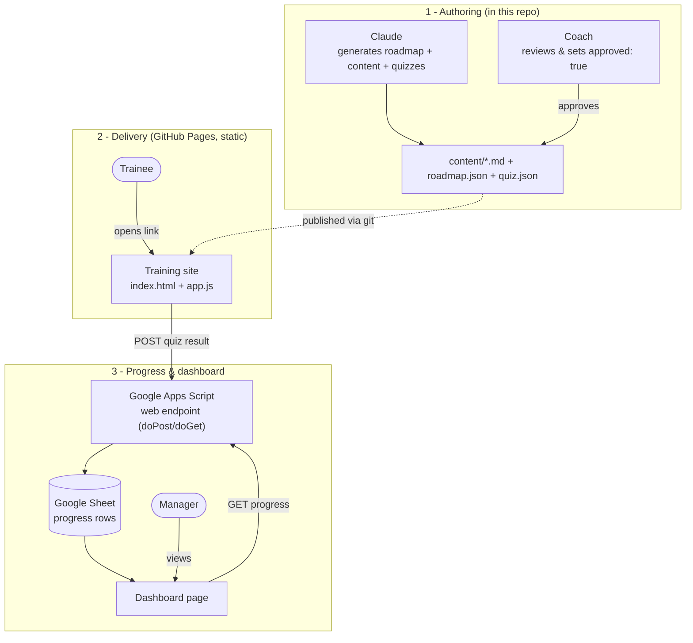

# Approach A — Static Site + Google Sheets

> Recommended starting point. No server to run. Free. ~1 day to a working skeleton.

A static website (hosted free on GitHub Pages) delivers the training. Trainee progress
and quiz scores are written to a **Google Sheet** through a small **Google Apps Script**
web endpoint. The manager dashboard reads from that same Sheet.

## Why this works without a backend

A static site can't write to a database on its own. The trick: deploy a ~15-line Google
Apps Script as a web app. It exposes a URL that accepts `POST` (append a progress row) and
`GET` (read progress for the dashboard). That script *is* your backend — hosted and run by
Google, nothing for you to maintain.

## Architecture diagram



### ASCII fallback

```
  Claude ─gen─► content files ◄─approve─ Coach
                     │ (git push)
                     ▼
             GitHub Pages (static site) ◄── Trainee
                     │  POST result        (soft gating in browser)
                     ▼
        Google Apps Script endpoint
                     │
                     ▼
             Google Sheet (progress)
                     │
                     ▼
             Dashboard page ◄── Manager
```

## Components

| Component | What it is | Where it lives |
|-----------|-----------|----------------|
| Content files | `roadmap.json`, `content.md`, `quiz.json` per section | This repo, `content/` |
| Training site | Plain HTML/JS, no framework | GitHub Pages, `site/` |
| Endpoint | Google Apps Script web app | script.google.com |
| Progress store | Google Sheet | Google Drive |
| Dashboard | HTML page reading the Sheet | GitHub Pages, `dashboard/` |

## Repo layout

```
content/
  technical/
    roadmap.json          # ordered sections + "approved" flags + track metadata
    01-intro/
      content.md          # the lesson (Claude-generated, coach-approved)
      quiz.json           # questions, correct answers, pass threshold
    02-.../
  non-technical/
    roadmap.json
    ...
site/                     # trainee-facing (GitHub Pages root)
  index.html  app.js  styles.css
dashboard/
  index.html              # manager/coach progress view
apps-script/
  Code.gs                 # the Sheet endpoint (paste into script.google.com)
```

## Data flow

1. **Author** — Claude generates a section's `content.md` + `quiz.json`; coach reviews and
   sets `"approved": true` for that section in `roadmap.json`. Un-approved sections are
   filtered out and never render for trainees.
2. **Publish** — push to GitHub; Pages serves the updated site automatically.
3. **Learn** — trainee opens the link, enters name/email once (stored in `localStorage`),
   picks a track, and reads sections in order.
4. **Assess** — at the end of a section the quiz is graded in the browser. On pass:
   the next section unlocks locally **and** a result row is `POST`ed to the endpoint.
5. **Track** — the Apps Script appends `{name, email, track, section, score, timestamp}`
   to the Sheet. The dashboard `GET`s these rows and renders a per-trainee progress table.

## Identity & progress tracking

There is no real authentication (honor-system). "Login" means **identifying who the person
is** so progress can be keyed to them.

- **Identity = personal link.** The coach gives each trainee a unique link, e.g.
  `.../index.html?id=alice@org.com`. The `id` in the URL is the key for all their data — no
  typing, no password, no picking from a list.
- **Progress source = Sheet-as-truth.** On load the app calls `GET ?id=<their id>`, gets the
  list of sections they've already passed, and rebuilds the sequential-unlock state from that.
  `localStorage` is only a fast cache. This means progress **follows the person across
  devices** and survives a cleared browser.

### Two-person example (Alice & Bob)

```
Alice opens her link ─► GET ?id=alice@org.com
                        ◄─ Sheet: passed [Module 0, Module 1]
                        ─► unlock up to Module 2, hide the rest
Alice passes Module 2 ─► POST result ─► row appended, keyed to alice@org.com
Bob does the same     ─► rows keyed to bob@org.com
Dashboard             ─► "Alice 3/11 · Bob 1/11"
```

### Google Sheet layout (two tabs)

**`Roster`** — the coach adds each trainee here; lets the dashboard show everyone, including
people who haven't started (0/N).

```
id (email) | name | track | start_date
```

**`Progress`** — one row per quiz attempt, appended by the endpoint.

```
timestamp | id | name | track | section_id | score | passed
```

The dashboard joins `Roster` × `Progress` to compute each person's completion %.

**Caveat:** anyone with Alice's link could claim to be Alice — accepted trade-off for
honor-system internal training. If trustworthy identity is ever required, that's the trigger
to move to the Supabase approach.

## Coach approval, without code

Approval is just a flag. Two options:
- **Technical coach:** approve by editing `roadmap.json` / merging a git PR.
- **Non-technical coach:** we provide a read-only **review page** that renders each draft
  section nicely; the coach signs off, and whoever manages the repo flips the flag. (Or the
  `approved` flag itself can be driven from a second tab in the same Google Sheet if you
  want the coach to stay entirely in Sheets.)

## Sequential gating (soft)

The browser stores completed section IDs in `localStorage`; section N+1 renders locked
until section N's quiz passes. A determined developer could bypass the client lock, but the
authoritative record of who actually passed lives in the Sheet regardless. This matches the
"honor system" choice — appropriate for internal training.

## Pros / cons

**Pros**
- No server, no framework, free hosting and storage.
- Non-technical coach/manager can read the Sheet directly.
- Content is version-controlled in git.
- Fast to stand up; easy to hand off.

**Cons**
- No real authentication — identity is self-reported.
- Client-side gating is bypassable.
- Apps Script has quotas (fine for small teams, not thousands of concurrent writes).
- Not suitable for formal/audited certification.

## Setup checklist

1. Create the repo folders and a sample section.
2. Build the static site (`site/`) with roadmap rendering, sequential gating, quiz grading.
3. Create a Google Sheet; add the Apps Script (`Code.gs`) with `doPost`/`doGet`; deploy as
   a web app ("anyone with the link").
4. Paste the endpoint URL into the site config.
5. Build the dashboard page.
6. Enable GitHub Pages on the repo; share the link.

## Cost

Free at small scale — GitHub Pages, Google Sheets, and Apps Script all have generous free
tiers.
