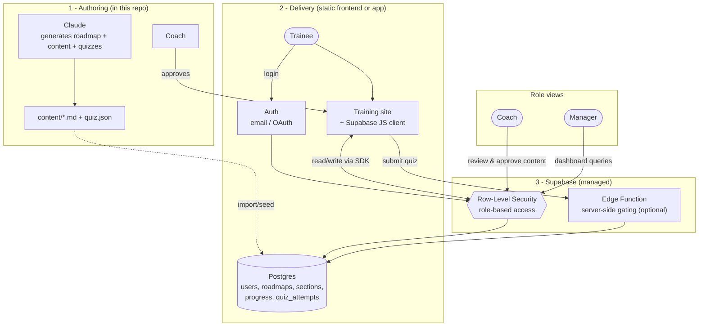

# Approach B — Supabase

> Upgrade path. Use when you need real logins, server-enforced gating, or auditable
> certification. ~2–4 days to stand up.

Same three-layer shape and same content/quiz files as Approach A, but the progress store
becomes a real **Supabase** (hosted Postgres) database with **authentication** and
**Row-Level Security (RLS)**. This makes identity real and makes "can't jump ahead"
enforceable on the server, not just in the browser.

## What Supabase gives you

- **Auth** — email/password or OAuth (Google, GitHub). Every trainee is a verified user.
- **Postgres database** — progress, quiz attempts, content approval status as real tables.
- **Row-Level Security** — a trainee can only read/write their own progress; a coach can
  read all and approve; a manager can read the aggregate. Enforced by the database.
- **Auto REST/JS client** — the static frontend talks to Supabase via its JS SDK; no custom
  backend code to host.
- **Edge Functions (optional)** — server-side logic (e.g. "unlock next section only if the
  quiz genuinely passed") so gating can't be faked from the client.

## Architecture diagram



### ASCII fallback

```
  Claude ─gen─► content files ──seed──► Supabase DB
                                            ▲
        Trainee ──login──► Auth ──► RLS ────┤ (users, sections,
                                            │  progress, quiz_attempts)
  Static site + Supabase JS SDK ◄──read/write──┘
        │                                   ▲
        └── submit quiz ─► Edge Function ───┘ (server-enforced gating)

  Coach ──review/approve──► DB (approved flag, coach role)
  Manager ──dashboard queries──► DB (aggregate progress)
```

## Data model (tables)

| Table | Key columns | Purpose |
|-------|-------------|---------|
| `profiles` | `id (=auth user)`, `full_name`, `role` (trainee/coach/manager) | Who + their role |
| `tracks` | `id`, `name` (technical / non-technical) | The two roadmaps |
| `sections` | `id`, `track_id`, `order`, `title`, `content`, `approved` | Ordered lessons |
| `quizzes` | `id`, `section_id`, `questions (jsonb)`, `pass_threshold` | Assessment per section |
| `progress` | `user_id`, `section_id`, `status`, `completed_at` | What each trainee finished |
| `quiz_attempts` | `user_id`, `quiz_id`, `score`, `passed`, `attempted_at` | Assessment history |

## Access control (RLS policies)

- **Trainee** — `SELECT`/`INSERT` only their own `progress` and `quiz_attempts`; can read
  only `approved` sections up to their current unlocked one.
- **Coach** — read all sections and content; `UPDATE sections.approved`.
- **Manager** — read all `progress`/`quiz_attempts` (aggregate dashboard); no write.

Because these rules live in the database, gating and privacy hold even though the frontend
is still just static files.

## Content approval

The `sections.approved` flag drives visibility, same concept as Approach A but stored in the
DB. The coach flips it from a simple admin view (or directly in the Supabase table editor).
Content itself is still authored by Claude in this repo and seeded/synced into the DB.

## Sequential gating (hard)

An **Edge Function** grades the quiz server-side and writes both the `quiz_attempt` and the
next-section unlock in one transaction. The client cannot unlock a section by editing local
state — the server is the source of truth.

## Pros / cons

**Pros**
- Real, verified identities and secure per-user data.
- Server-enforced gating — suitable for certification/audit.
- Scales well beyond small teams.
- Rich SQL querying for the dashboard.

**Cons**
- More setup and concepts (auth, RLS policies, migrations).
- A managed service to keep an eye on (though free tier is generous).
- Slightly more for a non-technical coach to learn than a Google Sheet.

## Setup checklist

1. Create a Supabase project; enable Auth (email + optional OAuth).
2. Create the tables above and write RLS policies per role.
3. Seed `tracks`/`sections`/`quizzes` from the repo content files.
4. Build the static frontend using the Supabase JS SDK for read/write.
5. Add an Edge Function for server-side quiz grading + section unlocking.
6. Build the dashboard using aggregate queries.
7. Host the frontend (GitHub Pages, Vercel, Netlify — all fine).

## Cost

Free tier covers small teams (limited rows, storage, and monthly active users). Paid plans
start when you exceed those limits — pay-as-you-grow.

## Migrating from Approach A

The content files (`content.md`, `quiz.json`) and the roadmap ordering carry over unchanged.
The migration work is: move progress from the Sheet into the `progress`/`quiz_attempts`
tables, add auth, and swap the frontend's `POST`-to-Apps-Script calls for Supabase SDK
calls. The learner-facing UI barely changes.
